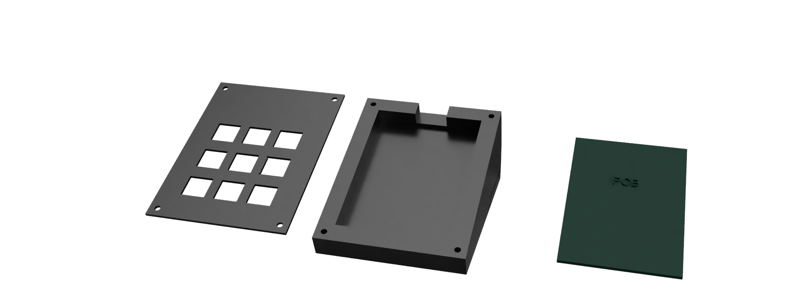
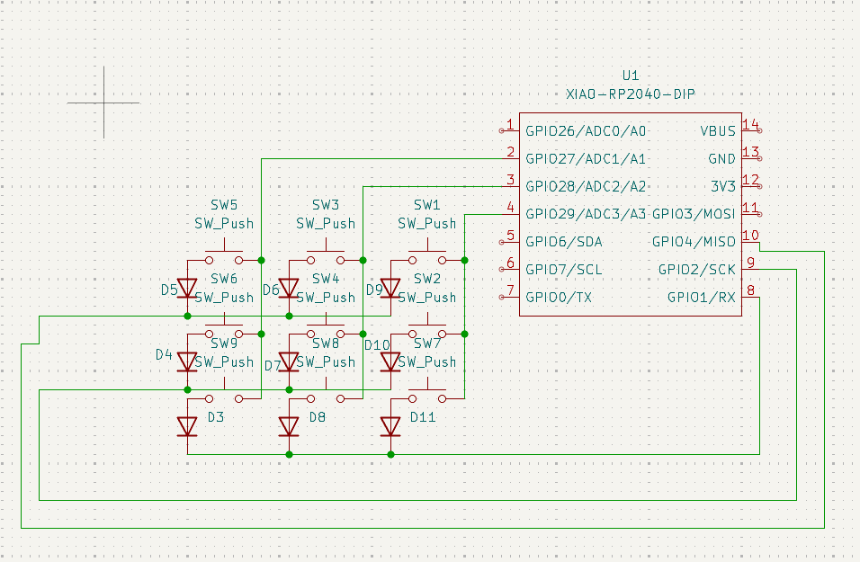
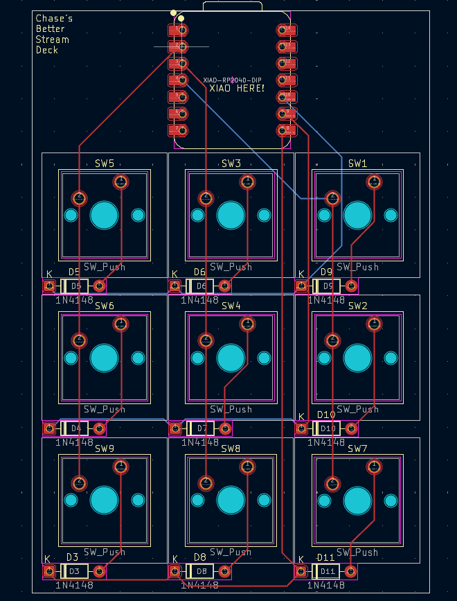

# Chase's Better Stream Deck
The BSD is a multifunctional Macropad designed to be a low cost, high function replacement to the expensive macropads currently found on the market.

## 3D Model

My model has 3 main parts:

- Top Cover to hide PCB
  
- Main Case (at 20 degree incline for eaiser reachability)
  
- PCB
  

Above are the parts from left to right.
## PCB
PCB Made in KiCad

Schematic:

PCB:

## Firmware

Uses KMK for firmware. Macros are handled by AutoHotKey.

## BOM

Materials Required:
- 1 Seeed XIAO RP2040
  
- 9 MX-Style switches

- 9 Through-hole 1N4148 Diodes

- 9 Keycaps (I would 3d print your own so you can add your own logos onto them)

- 4 M3x16mm screws

- 4 M3x5mx4mm heatset inserts

- 1 Case (2 3D printed parts)
